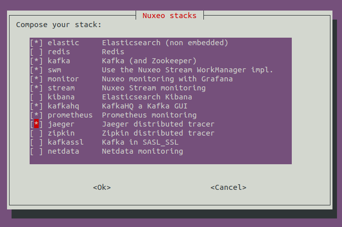

# Nuxeo stacks: a docker compose generator

## About
The intend of nuxeo stacks is to create custom environment to test and debug different Nuxeo configurations.

Once you have selected the stack that you want to run, an isolated environment is created.
This environment is a repository, it uses a normal docker compose file configured with volumes.


Again this is for testing and **NOT FOR PRODUCTION**.

The Nuxeo versions supported are:

- Nuxeo latest
- Nuxeo 10.10
- Nuxeo 9.10
- Nuxeo 8.10
- Nuxeo 7.10

You can choose to run Nuxeo in cluster mode up to 3 nodes.

The backend services supported are:
- MongoDB 
- PostgreSQL
- Elasticsearch
- Kafka (with option for SSL/SASL)
- Zookeeper
- Redis

The version and configuration of services are adapted depending on the Nuxeo version
(for instance Nuxeo 8.10 uses Elasticsearch 2.3).

In addition of the Nuxeo stack you can add useful tooling:
- Grafana/Graphite: a monitoring solution with a provisioned Nuxeo dashboard
- Kibana: the Elasticsearch GUI
- KafkaHQ: a Kafka GUI
- Netdata: for OS monitoring, though it is much better to install netdata directly on the host
- Prometheus: an alternative to graphite monitoring
- Jaeger: a Tracer for distributed tracing
- Zipkin: an alternative Tracer for distributed tracing

# Demo

Click on the screenshot below for an animated gif demoing how to start a Nuxeo cluster of 2 nodes with MongoDB, Elasticsearch, Kafka, Grafana and KafkaHQ in 2min:

[](https://github.com/bdelbosc/nuxeo-stacks/releases/download/demo/nuxeo-stacks-demo.gif)

Of course the first time you use nuxeo stacks it will take longer because you have to pull docker images.

# Installation

First you need to install [docker-compose](https://docs.docker.com/compose/install/) on the machine running the stack.

The generation of the Nuxeo stack is done using [ansible](https://www.ansible.com/) which will be automatically installed in a `virtualenv` when executing the `nuxeoenv.sh` script.

The only requirements are: `pip`, `virtualenv`, `whiptail` and `jq`.
To install theses requirements:

On Mac OS:
```bash
brew install python newt jq
pip3 install virtualenv
```

On Ubuntu:
```yaml
sudo apt install python3-pip jq
pip3 install virtualenv
```

# Usage

Simply run the `nuxeoenv.sh` script and compose interactively your stack by selecting what you need.

```bash
./nuxeoenv.sh
...
---------------------------------------------------------------
# This Nuxeo Stack can be rebuilt with the following command:
./nuxeoenv.sh -i "/home/ben/dev/envs/nuxeo-stacks/instance.clid" -d "/tmp/my-nuxeo-env" -c no -n nuxeolatest -b mongo -s '"elastic" "redis"'
# Next steps:
cd /tmp/my-nuxeo-env
docker-compose up
http://nuxeo.docker.localhost/nuxeo -> Nuxeo Administrator/Administrator
http://elastic.docker.localhost/ -> Elasticsearch
```

This will generate a docker compose file in the target environment directory, 
from there, you can up/stop your env like any docker compose env.

```bash
# Add a -d to run in background
docker-compose up
# List docker containers
docker ps
# Stops containers and removes containers and named volumes
docker-compose down --volume
```

Note that you can use `stop` to stop an env but you need to use `down --volume` before switching to different stack or you will have error like:
```bash
ERROR: for elastic  Cannot create container for service elasticsearch: Conflict. The container name "/elastic" is already in use by container "3a7a444f4a01e0286ea54edabde0549be8564fd538d72d88b58661f6e73c4c62". You have to remove (or rename) that container to be able to reuse that name.
# To solve this use: docker rm <CONTAINER-ID>
```

All data are persisted using docker volumes inside your env, you can resume any env using a `docker-compose up`.

## Stack exposition

All HTTP services are exposed by [traefik](https://traefik.io/) with proper hostname:

|URL | auth | description |
| --- | --- | --- |
| http://nuxeo.docker.localhost/ | Administrator/Administrator | Nuxeo load balanced when in cluster mode|
| http://nuxeo-node.docker.localhost/ | Administrator/Administrator | Nuxeo first node |
| http://nuxeo2-node.docker.localhost/ | Administrator/Administrator | Nuxeo second node |
| http://nuxeo3-node.docker.localhost/ | Administrator/Administrator | Nuxeo third node |
| http://elastic.docker.localhost | | Elasticsearch listening on port 80 (and not 9200) |
| http://kibana.docker.localhost | elastic/changeme | Kibana |
| http://grafana.docker.localhost | admin/admin | Grafana with a provisioned Nuxeo dashboard |
| http://graphite.docker.localhost |  | Graphite |
| http://kafkahq.docker.localhost |  | Kafka GUI |
| http://netdata.docker.localhost |  | Real time OS monitoring |
| http://prometheus.docker.localhost |  | Monitoring solution |
| http://jaeger.docker.localhost |  | Tracer for distributed tracing |
| http://zipkin.docker.localhost |  | Tracer for distributed tracing |
|--- | --- | ---|
| http://traefik.docker.localhost/ | | Traefik dashboard |
 

Other non HTTP services are accessible using docker.
It is straightforward because container name are set, for instance:

- Run a shell on the first nuxeo node: 
  ```bash
  docker exec -it nuxeo bash
  ```  

- Get the nuxeo log of the second node:
  ```bash
  docker logs nuxeo2
  ```  

On section below you will find interesting shortcut.

## Batteries included

In the `./bin` directory of you environment there are useful shortcuts:
- `nuxeoctl.sh` Direct nuxeoctl invocation
- `stream.sh` Direct stream.sh invocation
- `mongo.sh` Run the mongo client
- `psql.sh` Run the PostgreSQL client
- `redis-cli.sh` Run the redis client


And scripts:
- `import.sh` Run a small import 2k docs
- `reindex.sh` Re-index the document repository (using the WorkManger)
- `nxql.sh` Run an NXQL query using the REST API, for instance:
  ```bash
  NXQL="SELECT * FROM Document" ./bin/nxql.sh
  ```
- `tail-audit.sh` tail -f on the audit stream
- `threaddump.sh` Perform a thread dump of Nuxeo
- `debug-nuxeo.sh` Expose the a Nuxeo node for remote debugging (localhost:8787)
- `expose-port.sh` Expose any container port to localhost without restarting container
- `pg-info.sh` Perform the PosgreSQL reporting problem procedure
- `elastic-info.sh` Perform the Elasticsearch reporting problem procedure
- `bulk-done.sh` List latest bulk command completed
- `bulk-scheduled.sh` List latest bulk command scheduled
- `bulk-reindex.sh` Run bulk command to re-index the repository
- `bulk-export.sh` Run bulk CSV export of the repository
- `bulk-status.sh` Get the status of the last submitted bulk command
- `kafka-list-consumer-gropus.sh` List all consumer groups at Kafka level
- `kafka-list-consumer-positions.sh` List the a consumer group position at Kafka level
- `kafka-list-topics.sh` List Kafka topics
- `esync.sh` Run the [esync](https://github.com/nuxeo/esync) tool to check the discrepancy between repository and elastic
  you need to expose the database port before running esync for instance:
  ```bash
  CONTAINER=mongo PORT=27017 ./bin/expose-port.sh
  # or for PostgreSQL:
  # CONTAINER=postgres PORT=5432 ./bin/expose-port.sh
  # on another term
  ./bin/esync.sh
  ```
# FAQ
## How to debug a specific Nuxeo node ?

To debug the third Nuxeo node of your cluster (nuxeo3):
```bash
NUXEO=nuxeo3 ./bin/debug-nuxeo.sh
```

Then attach your debugger to `localhost:8787`

## How can I expose locally a container port ?

To expose redis:6379 to localhost:6379:
```bash
CONTAINER=redis PORT=6379 ./bin/expose-port.sh
```

## How to add a custom Nuxeo Package ?

In your env just edit the `./nuxeo/init-nuxeo.sh` script and add your package.

## How can I deploy my env to a remote host ?

Edit the `hosts` file and add your target server. You need
You need to be able to `ssh <your-target-server>` without being prompted for a password.
If it is not the case, try something like:
```bash
ssh-copy-id <your-target-server>
```

# Limitations

Some stacks are not possible or not yet supported:

- Nuxeo 7.10/8.10
  - cluster mode not supported by nuxeo stacks
  - No Kafka (Nuxeo Stream is supported on 9.10)
- Grafana dashboard is for Nuxeo 10.10
- KafkaHQ is not configured to support Kafka in SSL SASL
- Jaeger/Zipkin and Prometheus will work with Nuxeo once [NXP-26799](https://jira.nuxeo.com/browse/NXP-26799) is merged

# TODO

- Add Prometheus exporter with provisioned Grafana dashboard for each service:
  - elasticsearch
  - mongo
  - redis
  - postgresql
  - kafka

- Add a Confluent Kafka with KSQL

- Add script to run webdriver tests

- Add script to run gatling tests

- Fix import-files.sh script:
  - install nuxeo-dam
  - add volume to share data to import

- Add option for multi env (or not ?)
  - Prefix all container, volume, route (using COMPOSE_PROJECT_NAME ?)
  - set a domain name (http://nuxeo.my-env.localhost)

- Elastic head plugin -> nginx ?

- Flight recorder 
  - requires non official nuxeo image with Oracle (or check latest OpenJDK)

- Java flamegraph [NXBT-1417](https://jira.nuxeo.com/browse/NXBT-1417)
  - requires non official nuxeo image with Oracle (or check latest OpenJDK)

- Security checks
  - no /var/run/docker.sock (not possible for traefik, kafka, netdata ?)
  - no  --privileged ()
  - no root user
  - check base image used

# About Nuxeo

Nuxeo provides a modular, extensible Java-based
[open source software platform for enterprise content management](http://www.nuxeo.com/en/products/ep)
and packaged applications for
[document management](http://www.nuxeo.com/en/products/document-management),
[digital asset management](http://www.nuxeo.com/en/products/dam) and
[case management](http://www.nuxeo.com/en/products/case-management). Designed
by developers for developers, the Nuxeo platform offers a modern
architecture, a powerful plug-in model and extensive packaging
capabilities for building content applications.

More information on: <http://www.nuxeo.com/>
